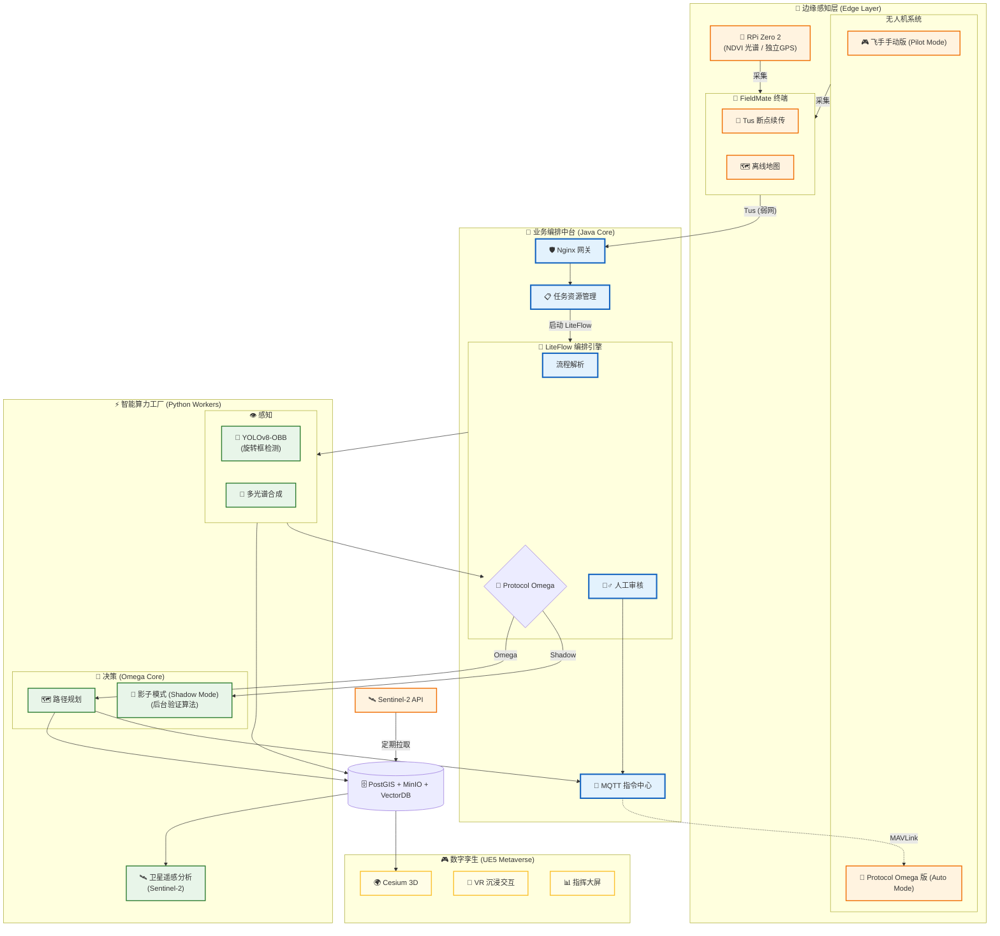

# 🌾 Sugarcane Enterprise (Agri-OS)

> **The Next-Gen Operating System for Precision Agriculture.**
> *感知 (Perception) · 决策 (Cognition) · 行动 (Action)*

  

---

## 📖 核心文档 (Documentation)
请优先阅读 `docs/` 目录下的三本白皮书：

1.  **[01_Requirements.md](docs/01_Requirements.md)** - **要做什么？** (Roadmap, 需求列表)
2.  **[02_Architecture.md](docs/02_Architecture.md)** - **怎么做？** (Protocol Omega, 系统架构图)
3.  **[03_Guide.md](docs/03_Guide.md)** - **怎么跑？** (Docker 部署, 开发手册)
4.  **[SCENARIO_PLAYBOOK.md](docs/design/SCENARIO_PLAYBOOK.md)** - **业务剧本** (核心逻辑推演验证)

---

## 🏗️ 系统架构 (Architecture)



Agri-OS 不仅仅是一个管理后台，它是一个 **Cyber-Physical System (CPS)**：

### 1. 🧠 业务编排 (Core)
*   **Tech**: Java 21, Spring Boot 3, LiteFlow
*   **Role**: 系统的左脑。负责任务调度、权限控制 (RBAC)、设备管理 (Fleet)。
*   **Key**: `LiteFlow` 规则引擎支持业务逻辑热更新。

### 2. ⚡ 智能算力 (Brain)
*   **Tech**: Python 3.10, PyTorch, YOLOv8-OBB
*   **Role**: 系统的右脑。负责视觉识别 (倒伏/病害)、卫星多光谱分析 (Sentinel-2)。
*   **Key**: **Protocol Omega** —— 当 AI 置信度极高时，自动接管无人机控制权。

### 3. 🚜 边缘感知 (Edge)
*   **Tech**: Android (FieldMate), DJI Mobile SDK, Raspberry Pi
*   **Role**: 系统的手眼。执行飞行任务，采集 4K 视频与多光谱数据。
*   **Key**: 支持 **Tus 断点续传**，适应山区弱网环境。

### 4. 🎮 数字孪生 (Metaverse)
*   **Tech**: Unreal Engine 5 (UE5), Cesium, VR
*   **Role**: 系统的全息映射。在办公室里通过 VR 实时查看 5 公里外的无人机姿态。

---

## 🚀 快速启动 (Quick Start)

### 1. 启动基础设施
```bash
cd sugarcane-infra
# 1. 配置环境变量
cp .env.example .env
# 2. 启动中间件 (Postgres, Redis, MinIO, EMQX)
docker-compose up -d
```

### 2. 导入数据库
```bash
# 待 SQL 设计完成后执行
docker exec -i sugarcane-postgres psql -U sugarcane -d sugarcane_db < ../docs/design/01_schema_v2.sql
```

---

## 🤝 贡献说明 (Contributing)
目前处于 **Phase 2 (架构设计)** 阶段。
请查看 [Project Board](https://github.com/users/fanpuyuan/projects/2) 领取任务。

*Copyright © 2024 Sugarcane Team. All Rights Reserved.*
