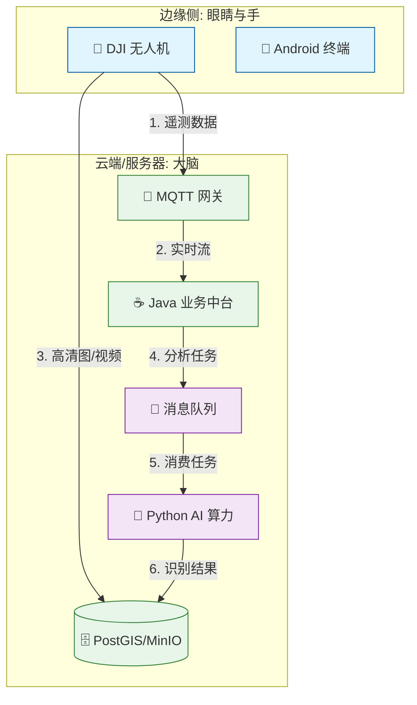

# 02. 技术架构 (System Architecture)

> **核心理念**: 感知 (Edge) -> 认知 (Brain) -> 决策 (Core) -> 行动 (Twin/Edge)

---

## 🏗️ 1. 系统架构图 (Architecture)

---

## 🛠️ 2. 技术栈清单 (Tech Stack)

### 2.1 后端核心 (`sugarcane-core`)
*   **Framework**: Spring Boot 3.2 (Java 17)
*   **Database**: PostgreSQL 16 + PostGIS (地理信息)
*   **Protocol**: MQTT (Mosquitto), HTTP/REST

### 2.2 AI 算力 (`sugarcane-brain`)
*   **Runtime**: Python 3.10
*   **Vision**: Ultralytics YOLOv8, OpenCV
*   **GIS**: Rasterio (NDVI 处理)

### 2.3 移动端 (`sugarcane-mobile`)
*   **OS**: Android (Kotlin)
*   **Hardware SDK**: DJI Mobile SDK v5
*   **Map**: Mapbox SDK

---

## 🔄 3. 核心数据流 (Data Flow)

### 场景：病害识别闭环
1.  **采集**: 无人机拍摄 4K 照片 -> 上传 MinIO 对象存储。
2.  **触发**: Java 收到上传通知 -> 写入 Redis 任务队列。
3.  **分析**: Python 监听队列 -> 下载图片 -> YOLO 推理 -> 生成 JSON 结果。
4.  **归档**: Python 将病害坐标写入 PostGIS 数据库。
5.  **展示**: Android 请求 API -> 在地图上绘制红色病害区域。
