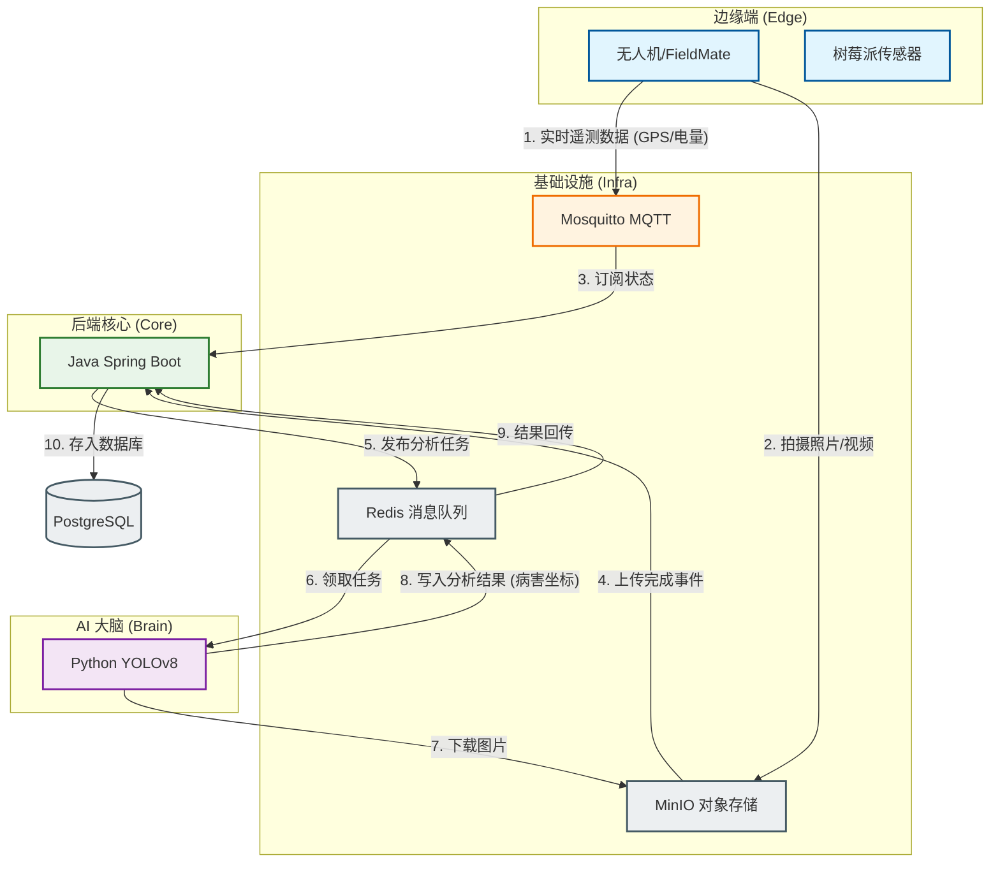
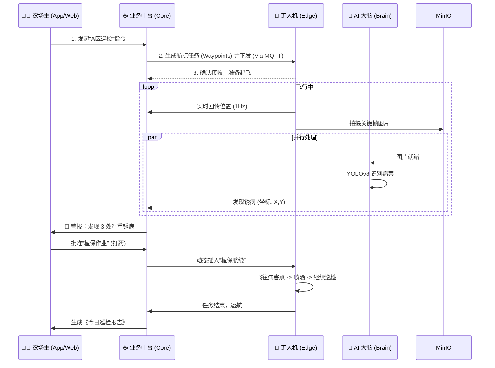

# Sugarcane Enterprise 系统流转图 (System Flow)

为了让您对“Agri-OS”的运行机理一目了然，我们整理了**信息流 (Data Flow)** 和 **工作流 (Workflow)** 两张核心图纸。

---

## 1. 核心逻辑：闭环 (The Loop)
整个系统的核心是一个闭环：
`感知 (看)` -> `认知 (想)` -> `决策 (管)` -> `行动 (做)`

1.  **Drones/IoT** 看到了甘蔗 (感知)。
2.  **AI** 识别出了病害 (认知)。
3.  **Java Core** 生成了植保任务 (决策)。
4.  **Drones** 起飞喷洒药水 (行动)。

---

## 2. 信息流 (Information Flow)
*数据是如何在网线里流动的？*

**关键路径解读：**
1.  **快数据 (Hot Data)**：无人机的位置、速度、电量，通过 MQTT 毫秒级传给 Java，实时在屏幕上跳动。
2.  **大笨数据 (Blob Data)**：4K 视频、高 清照片，直接丢进 MinIO 仓库，只把“取货码（URL）”传给后台，避免堵塞网络。
3.  **冷计算 (Cold Calc)**：AI 分析比较慢，所以 Java 把任务丢进 Redis 队列（信箱）就去忙别的了；Python 慢慢处理完，再要把结果塞回信箱。

---

## 3. 工作流 (Workflow)
*用户的一天是如何度过的？*

### 场景：执行全自动巡检与病害清除

这个流程展示了从**用户决策**到**物理执行**，再到**数字反馈**的全过程。我们的系统不仅仅是显示数据，更重要的是**闭环控制**。
