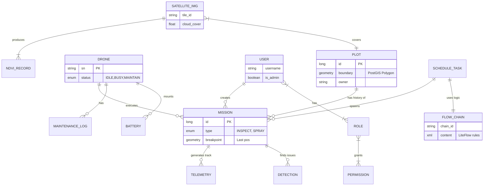

# 🗺️ 全局数据模型图谱 (Global Data Model)

> **设计原则**: 从宏观到微观。先看清实体间的关系 (ERD)，再扣表结构细节 (DDL)。

## 🌌 宏观实体关系图 (The Macro ERD)

---

## 🔬 微观领域划分 (Micro Domains)

### 1. 核心资产域 (Core Domain)
*   **Plot (地块)**: 一切的基石。
*   **Mission (任务)**: 将人、机、地连接起来的动态过程。

### 2. 资源守护域 (Resource Domain)
*   **Drone (无人机)**: 不只是设备，是需要维护的资产。
*   **Battery (电池)**: 消耗品，生命周期管理。

### 3. 感知智能域 (Intelligence Domain)
*   **Satellite (卫星)**: 宏观视角，发现问题区域。
*   **Detection (识别)**: 微观视角，YOLO 发现具体病害。

### 4. 规则调度域 (Orchestration Domain)
*   **Schedule (排班)**: 什么时候飞？
*   **FlowChain (规则)**: 飞的时候听谁的？(Protocol Omega)
