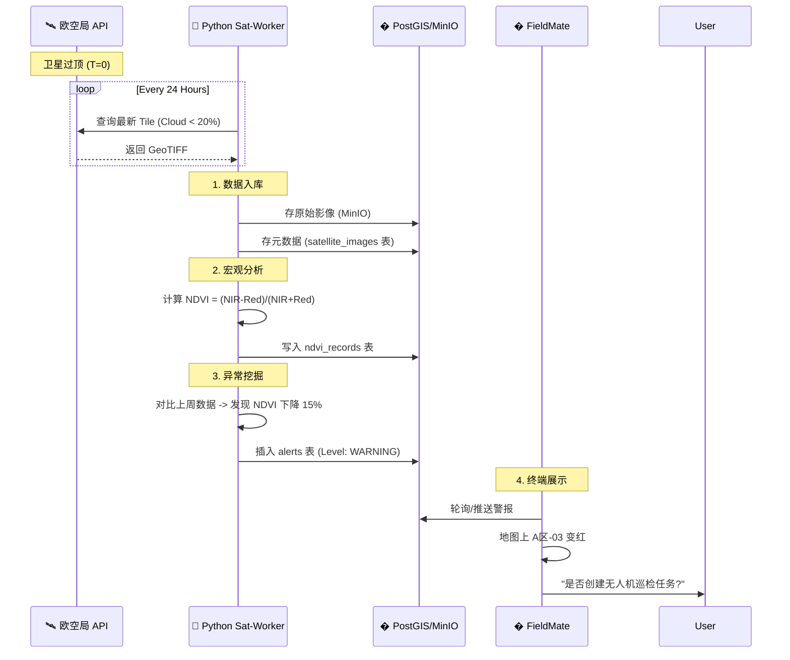
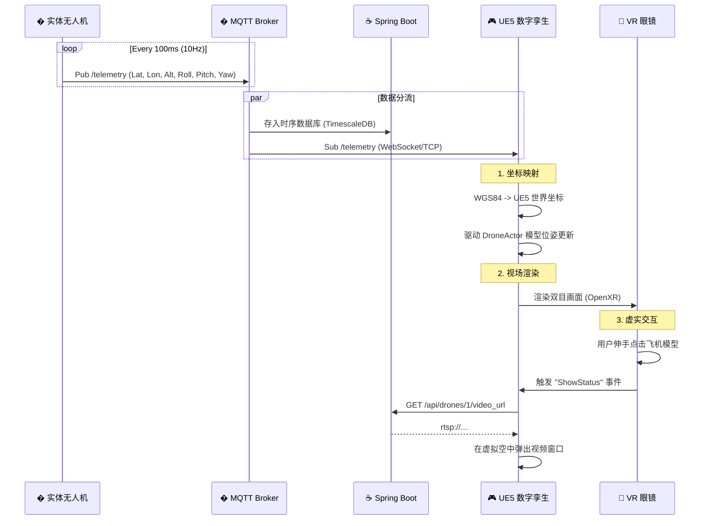
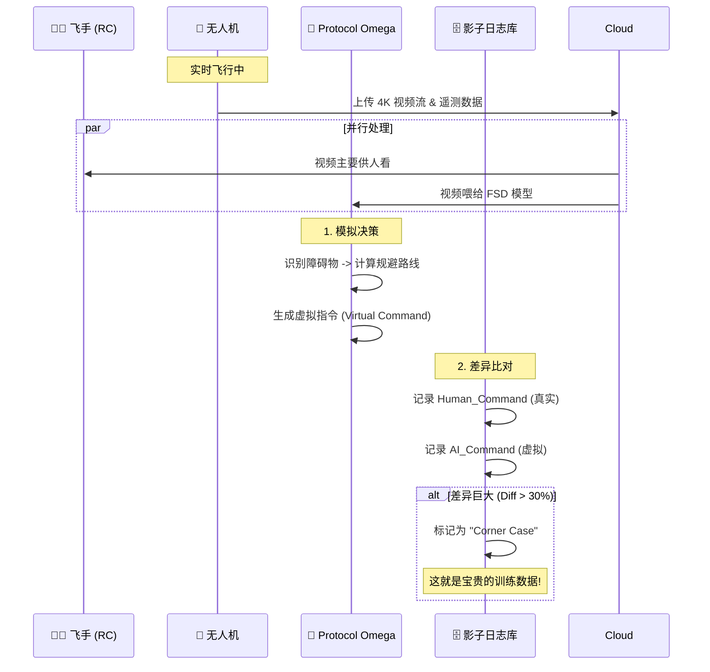

# 🎭 Agri-OS 全景业务剧本 (The Scenario Playbook)

> **文档定位**: 这是我们的**逻辑验证平台**。在写代码前，所有业务必须在这里跑通。
> **覆盖范围**: 边缘(Edge) -> 连接(Link) -> 大脑(Brain) -> 孪生(Twin) -> 外部(Space)。

---

## 🛰️ 第一幕: 天眼感知 (The Satellite Loop)
*角色: Sentinel-2 卫星, Python Worker, PostGIS, FieldMate App*

### 剧情概要
每周一，卫星扫描农场。系统自动拉取数据，分析 NDVI 植被指数，发现“A区-03”地块似乎变黄了，主动推送预警给农场主。

### 详细推演

---

## � 第二幕: 数字孪生 (The Metaverse Loop)
*角色: DJI Drone, MQTT Broker, Spring Core, UE5 Engine, VR Headset*

### 剧情概要
农场主戴上 VR 眼镜，坐在办公室里。此时无人机在 5 公里外作业。他能在 VR 里看到飞机实时位置，不仅是地图上的点，而是**真实的三维模型在飞**，且能看到飞机视角传回的画面。

### 详细推演

---

## 👻 第三幕: 影子模式 (The Shadow Mode Loop)
*角色: FieldMate (Pilot), Protocol Omega (AI), Mqtt*

### 剧情概要
现在是**人工飞行模式**。飞手在操纵飞机。后台的 AI (Omega) 也在通过摄像头看，它在默默计算“如果是我，我会怎么飞”。如果不一致，它会记录下来用于自我进化。

### 详细推演

---

## 🚁 第四幕: 机队与场站 (Fleet & Station)
*角色: Drone, Battery Station, Repairman*

*(此处衔接之前的“换机续飞”推演)*

1.  **入库校验**: 飞机归还时，必须扫码入库。系统自动读取 flight_log，发现“电机震动异常”，自动锁定飞机状态为 `MAINTENANCE`，并给维修员发工单。
2.  **电池轮转**: 智能电池柜读取电池循环次数。如果 > 300 次，自动标记“需报废”，禁止被借出。

---

## 📝 剧本总结：缺少的拼图

通过这 4 幕大戏，我们需要补充以下架构实体：

1.  **Satellite Importer**: 需要一个 Python 脚本 `sat_sync.py`，专门对接 Sentinel-2 API。
2.  **UE5 Connector**: 后端需要一个 WebSocket 服务端，专门给 UE5 喂饭。
3.  **Shadow Logger**: 数据库表 `shadow_logs`，专门存 AI 和人的操作差异。
4.  **Battery Health**: 电池不是简单的电量，是全生命周期管理。

**这个全景剧本，是您想要的“工作平台”吗？**
如果是，请批准 `SCENARIO_PLAYBOOK.md`，然后我们按照剧本里的角色分配任务。
