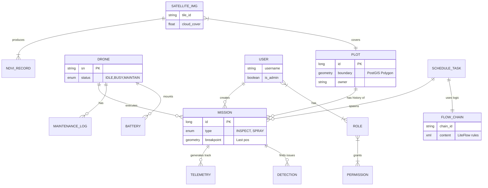

# ğŸ—ºï¸ å…¨å±€æ•°æ®æ¨¡å‹å›¾è°± (Global Data Model)

> **设计åŸåˆ™**: ä»å®è§‚到微观。先看清å®ä½“间的关系 (ERD)，å†æ‰£è¡¨ç»“æ„细节 (DDL)。

## 🌌 å®è§‚å®ä½“关系图 (The Macro ERD)

```mermaid
erDiagram
    %% Core Domain
    PLOT ||--o{ MISSION : "has history of"
    PLOT {
        long id PK
        geometry boundary "PostGIS Polygon"
        string owner
    }
    
    %% Fleet Domain (机队)
    DRONE ||--o{ MISSION : "executes"
    DRONE ||--o{ MAINTENANCE_LOG : "has"
    DRONE ||--o{ BATTERY : "mounts"
    DRONE {
        string sn PK
        enum status "IDLE,BUSY,MAINTAIN" 
    }
    
    %% Auth Domain (æƒé™)
    USER ||--o{ MISSION : "creates"
    USER }|--|{ ROLE : "has"
    ROLE }|--|{ PERMISSION : "grants"
    USER {
        string username
        boolean is_admin
    }
    
    %% Mission Domain (核心业务)
    MISSION ||--o{ TELEMETRY : "generates track"
    MISSION ||--o{ DETECTION : "finds issues"
    MISSION {
        long id PK
        enum type "INSPECT, SPRAY"
        geometry breakpoint "Last pos"
    }

    %% Satellite Domain (å®è§‚感知)
    SATELLITE_IMG ||--|{ NDVI_RECORD : "produces"
    SATELLITE_IMG }|--|| PLOT : "covers"
    SATELLITE_IMG {
        string tile_id
        float cloud_cover
    }

    %% Rule Domain (规则ä¸æ’ç­)
    SCHEDULE_TASK ||--o{ MISSION : "spawns"
    SCHEDULE_TASK ||--|| FLOW_CHAIN : "uses logic"
    FLOW_CHAIN {
        string chain_id
        xml content "LiteFlow rules"
    }

```

---

## 🔬 微观领域划分 (Micro Domains)

### 1. 核心资产域 (Core Domain)
*   **Plot (地å—)**: 一切的基石。
*   **Mission (任务)**: 将人ã€æœºã€åœ°è¿æ¥èµ·æ¥çš„动æ€è¿‡ç¨‹ã€‚

### 2. 资æºå®ˆæŠ¤åŸŸ (Resource Domain)
*   **Drone (无人机)**: ä¸åªæ˜¯è®¾å¤‡ï¼Œæ˜¯éœ€è¦ç»´æŠ¤çš„资产。
*   **Battery (电池)**: 消耗å“，生命周期管ç†ã€‚

### 3. 感知智能域 (Intelligence Domain)
*   **Satellite (å«æ˜Ÿ)**: å®è§‚视角，å‘ç°é—®é¢˜åŒºåŸŸã€‚
*   **Detection (识别)**: 微观视角，YOLO å‘ç°å…·ä½“病害。

### 4. 规则调度域 (Orchestration Domain)
*   **Schedule (æ’ç­)**: 什么时候é£ï¼Ÿ
*   **FlowChain (规则)**: é£çš„时候å¬è°çš„？(Protocol Omega)
